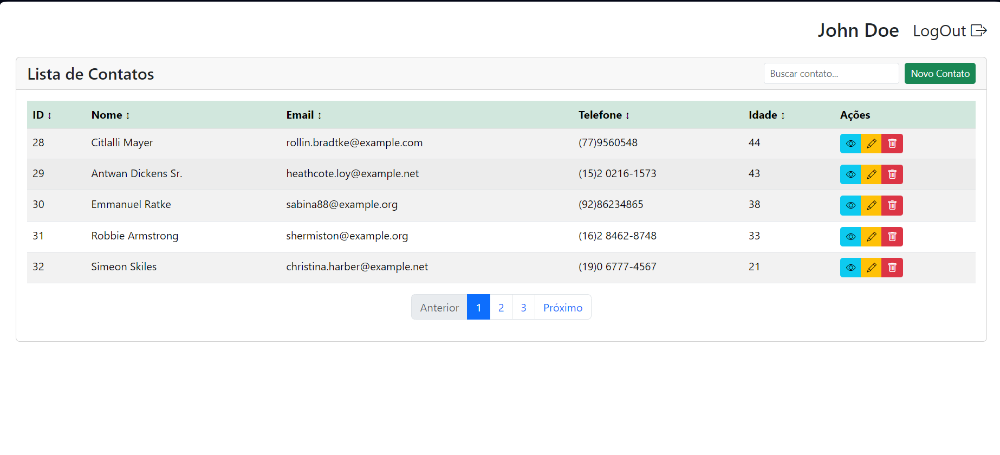
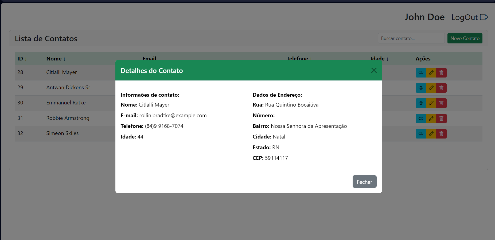
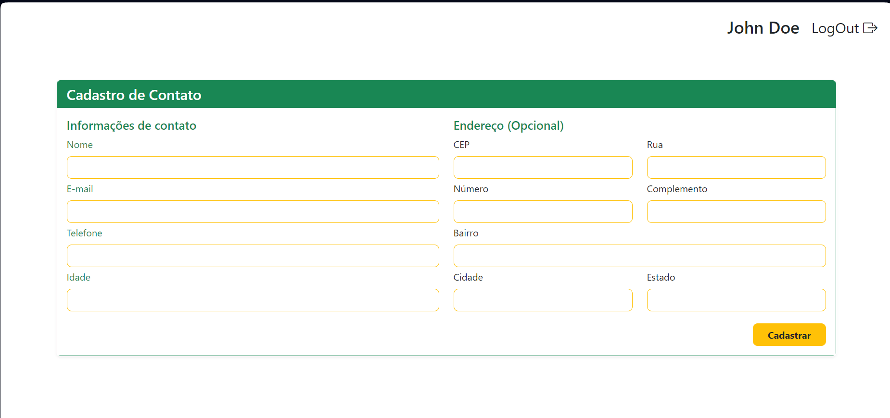
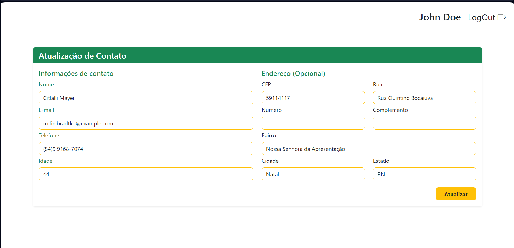
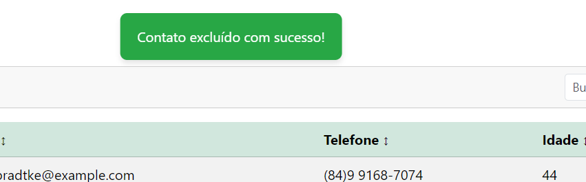

## INSTRUÇÕES:
*As instruções abaixo são orientações para buidar e servir o sistema de cadastro de contatos*

 - Clone o repositório: <code>git clone https://link_do_repositorio</code> 
 - Entre na pasta do projeto: <code>cd nome_projeto_clonado</code> 
 - Instale o composer: <code>php artisan composer install</code> 
 - Instale node_modules com npm: <code>npm install</code> 
 - Configure a conexão com o seu banco de dados postgres no .env
 - Execute as migrations: <code>php artisan migrate</code> 
 - Execute o DatabaseSeeder: <code>php artisan db:seed</code> 
 - Sirva a aplicação: <code>php artisan serve</code> 
 - Para buldar a aplicação: <code>npm run dev</code> 
 - Acesse a URL fornecida quando serviu a aplicação e faça Login com as credenciais abaixo: 
   - User: johndoe@example.com 
   - Password: secret 

#Tecnologias utilizadas:
 - Laravel 11
 - PHP
 - VueJS
 - Bootstrap5
 - PostgreSQL
 - HTML, CSS, Javascript
 - API ViaCEP

#OBSERVAÇÕES:
*As views se encontram dentro de C:\Users\Edmilson Jarbson\Desktop\libre-project\resources\js\Pages*
*O projeto está em monolito Laravel+VueJS com Inertia*
*Para o banco de dados foram implementadas 2 tabelas fora as padrões do Laravel: contacts e addresses e consequentemente 3 models sendo eles User, Contact e Adress*

#---------------------------------------------------# 

# Libre Soluções de Governo
## Processo Seletivo - Desenvolvimento

### Instruções Gerais

1. **Fork do Repositório:** Faça um fork **PÚBLICO** deste repositório.
2. **Tecnologias a serem utilizadas:**
   - **Backend:** Laravel 11
   - **Banco de Dados:** PostgreSQL
   - **Ambiente:** Livre (preferencialmente uso do Docker, mas não é obrigatório)
   - **Frontend:** Utilize um framework de sua preferência ou, se preferir, HTML5, JavaScript e CSS.

### Projeto: Cadastro de Contatos

#### Requisitos do Projeto

- **Página Principal:**
  - Exibir uma lista de contatos com os seguintes campos:
    - Sequencial
    - Nome
    - Telefone
    - Idade
  - Incluir uma barra de pesquisa para filtrar a lista de contatos.
  - Implementar paginação para a listagem.
  - Incluir um botão para cadastrar novos contatos.
  - Ao lado de cada contato, fornecer três botões de ação:
    - **Exibir Endereço:** Ao clicar, abrir um modal com o endereço do contato.
    - **Editar:** Permitir editar as informações do contato.
    - **Deletar:** Remover o contato da lista.

- **Tela de Cadastro:**
  - Permitir o cadastro de um novo contato, incluindo os campos de:
    - Nome
    - Telefone
    - Idade
    - Endereço (cep, rua, número, complemento, cidade, estado)

### Estilo e Design

- O estilo do site (cores, fontes e disposição dos elementos) é livre. Sinta-se à vontade para usar sua criatividade e refletir sua visão de design.

### Entrega

- Tempo de execução: 5 dias corridos (o tempo será contabilizado a partir da criação do Fork).